<!-- source: https://industrial.sherwin-williams.com/na/us/en/aerospace/catalog/category/products-by-industry/commercial-aviation.10656251.html -->

+----------------------------------------------------+----------------------------------------------------+
| **Hero-Industrial**                                                                                     |
+----------------------------------------------------+----------------------------------------------------+
| # Commercial Airline Products                      | 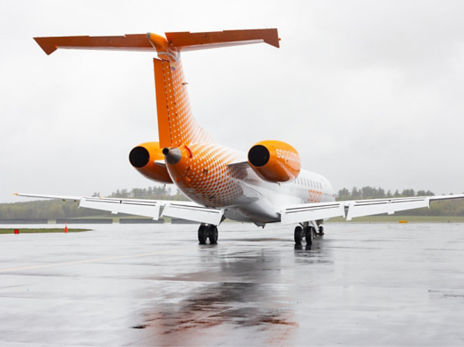 |
|                                                    |                                                    |
| ## Coatings solutions for your fleet               |                                                    |
|                                                    |                                                    |
| Whether commercial airline, regional jet or cargo carrier, Sherwin-Williams offers the ideal products for your airline livery. We excel at offering solutions that deliver color, performance and productivity for the aircraft cabin and exterior. The products range from pretreatments, corrosion resistant primers, fillers and surfacer for composites, flame-retardant cabin topcoats and high performing glossy topcoats. | |
|                                                    |                                                    |
| [Download Qualified Commercial Systems](/content/dam/pcg/sherwin-williams/aerospace/na/us/en-us/pdfs/commercial-paint-systems.pdf) | |
+----------------------------------------------------+----------------------------------------------------+

---

## Commercial Aviation Categories

+----------------------------------------------------+----------------------------------------------------+
| **Cards-Category**                                                                                      |
+----------------------------------------------------+----------------------------------------------------+
| 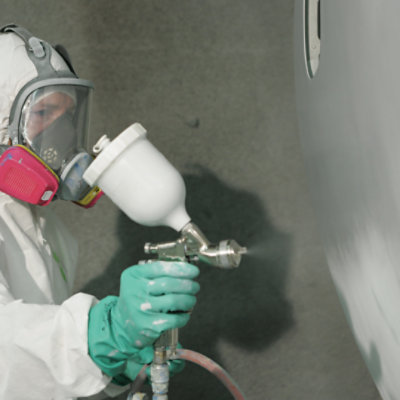 | [**Aircraft Primers**](/na/us/en/aerospace/catalog/category/products-by-industry/commercial-aviation/aircraft-primers.10656261.html) |
|                                                    |                                                    |
|                                                    | Sherwin-Williams is a leading manufacturer of high quality aerospace primers for commercial airlines |
+----------------------------------------------------+----------------------------------------------------+
| 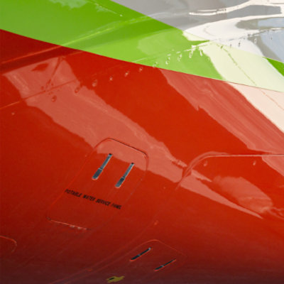 | [**Clearcoats**](/na/us/en/aerospace/catalog/category/products-by-industry/commercial-aviation/clearcoats.10656255.html) |
|                                                    |                                                    |
|                                                    | Sherwin-Williams offers high performance polyester urethane and acrylic urethane commercial clearcoats designed for use over our basecoats on exterior surfaces. |
+----------------------------------------------------+----------------------------------------------------+
| 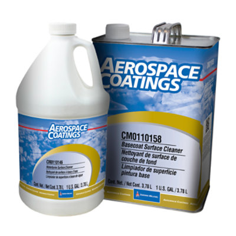 | [**Cleaners**](/na/us/en/aerospace/catalog/category/products-by-industry/commercial-aviation/cleaners.10656259.html) |
|                                                    |                                                    |
|                                                    | Sherwin-Williams offers a variety of commercial cleaners from wipes to waterborne and basecoat cleaners, we have the solution for you. |
+----------------------------------------------------+----------------------------------------------------+
| 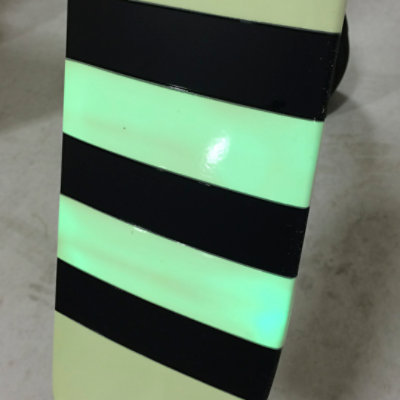 | [**Photoluminescent Paint**](/na/us/en/aerospace/catalog/category/products-by-industry/commercial-aviation/photoluminescent-paint.10656260.html) |
|                                                    |                                                    |
|                                                    | Sherwin-Williams Photoluminescent Paint for commercial aviation is placed on the tips of the aircraft propeller blades and helicopter rotors, creating visibility in dark and low light operations as a safety precaution for nearby personnel in hangers, airstrips, helipads, and repair facilities. |
+----------------------------------------------------+----------------------------------------------------+
|                                                    | [**Pre-Treatments**](/na/us/en/aerospace/catalog/category/products-by-industry/commercial-aviation/pre-treatments.10656257.html) |
|                                                    |                                                    |
|                                                    | Sherwin-Williams offers two-component chromated and vinyl wash commercial pre-treatments for simple mixing. |
+----------------------------------------------------+----------------------------------------------------+
|                                                    | [**Reducers**](/na/us/en/aerospace/catalog/category/products-by-industry/commercial-aviation/reducers.10656258.html) |
|                                                    |                                                    |
|                                                    | Sherwin-Williams is a leading manufacturer of high quality aerospace reducers for commercial aircraft. |
+----------------------------------------------------+----------------------------------------------------+
| 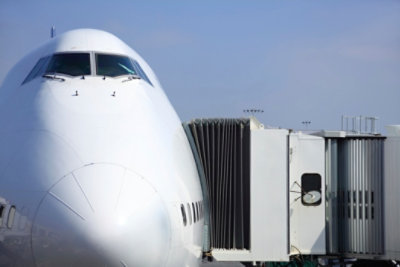 | [**Topcoats**](/na/us/en/aerospace/catalog/category/products-by-industry/commercial-aviation/topcoats.10656252.html) |
|                                                    |                                                    |
|                                                    | A quality paint job not only protects the plane, it also boosts an airline's brand image. An attractive, well-kept fleet is an airline's or cargo shipper's best advertisement. |
|                                                    |                                                    |
|                                                    | [Basecoat](/na/us/en/aerospace/catalog/category/products-by-industry/commercial-aviation/topcoats/basecoat.10656254.html) [Monocoat](/na/us/en/aerospace/catalog/category/products-by-industry/commercial-aviation/topcoats/monocoat.10656253.html) |
+----------------------------------------------------+----------------------------------------------------+

---

## Related Content

+----------------------------------------------------+----------------------------------------------------+
| **Cards-Category**                                                                                      |
+----------------------------------------------------+----------------------------------------------------+
| 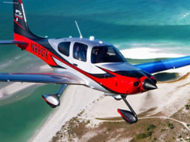 | [**General Aviation Products**](/na/us/en/aerospace/products-by-industry/general-aviation.html) |
|                                                    |                                                    |
|                                                    | We offer expertise for coating systems in any general aviation application - for both the aircraft exterior and cabin. |
+----------------------------------------------------+----------------------------------------------------+
| 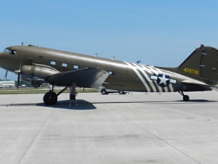 | [**Military/Defense Coatings**](/na/us/en/aerospace/products-by-industry/military-aircraft.html) |
|                                                    |                                                    |
|                                                    | Qualified coating systems for any military aircraft application. |
+----------------------------------------------------+----------------------------------------------------+
| 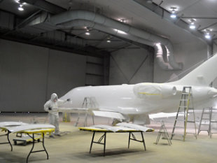 | [**Qualified Products**](/na/us/en/aerospace/products-by-industry/qualified-products-by-brand.html) |
|                                                    |                                                    |
|                                                    | From pre-treatments to clearcoats, Sherwin-Williams is qualified for numerous aircraft manufacturers, parts manufacturers and approving bodies. |
+----------------------------------------------------+----------------------------------------------------+

---

## Featured Media

+----------------------------------------------------+----------------------------------------------------+
| **Cards-Category**                                                                                      |
+----------------------------------------------------+----------------------------------------------------+
| 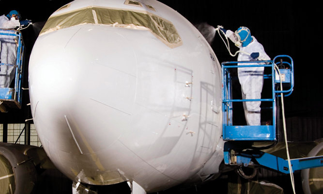 | **Article**                                        |
|                                                    |                                                    |
|                                                    | September 10, 2018                                 |
|                                                    |                                                    |
|                                                    | [**Cover Up**](/na/us/en/aerospace/media-center/articles/cover-up.html) |
+----------------------------------------------------+----------------------------------------------------+

---

+----------------------------------------------------+----------------------------------------------------+
| **Cards-Category**                                                                                      |
+----------------------------------------------------+----------------------------------------------------+
| 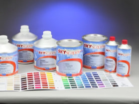 | **Product Lookup**                                 |
|                                                    |                                                    |
|                                                    | Explore our product solutions for a variety of applications and aircraft types. |
|                                                    |                                                    |
|                                                    | [Find a Product](/na/us/en/aerospace/products-by-industry/all-products.html) |
+----------------------------------------------------+----------------------------------------------------+
|  | **Ask Sherwin-Williams**                           |
|                                                    |                                                    |
|                                                    | Ask how Sherwin-Williams can bring the right products and expertise for your aircraft. |
|                                                    |                                                    |
|                                                    | [Contact Us](/na/us/en/aerospace/contact-us.html)  |
+----------------------------------------------------+----------------------------------------------------+

---

+---------------------------+-------------------------------------------------------------------+
| **Metadata**                                                                                  |
+---------------------------+-------------------------------------------------------------------+
| Title                     | Commercial Airline \| Sherwin-Williams                            |
+---------------------------+-------------------------------------------------------------------+
| Description               | Whether for the aircraft exterior or cabin, Sherwin Williams offers coating systems for commercial airline, regional carriers and cargo aircraft. |
+---------------------------+-------------------------------------------------------------------+
| Image                     | https://s7d2.scene7.com/is/image/sherwinwilliams/IMG_8863         |
+---------------------------+-------------------------------------------------------------------+
